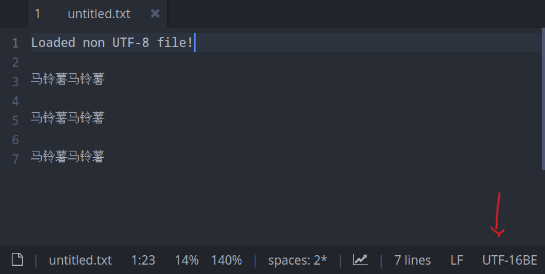
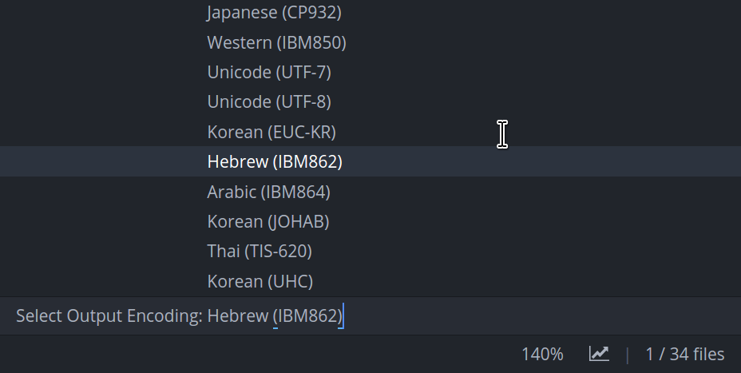

# Lite XL Encoding Plugin

This repository provides a **native** and **lua** plugin to extend lite-xl and
provide the missing functionality to handle document encodings.

## Native
Adds an API for automatic detection of files or strings encoding
using [uchardet](https://gitlab.freedesktop.org/uchardet/uchardet).
The api also exposes a customized `SDL_iconv_string()` to allow converting
between different encodings and functions for byte order marks handling.

You can view the API documention on the [docs](docs/encoding.lua) subdirectory.

## Lua
Leverages the native plugin to add automatic conversion from non-UTF8 encodings
to UTF-8 encoding on file load by autodetecting its encoding at load time.
It respects the detected file encoding by saving back from UTF-8 to the
originally detected encoding.

Also it handles byte order marks on UTF-16LE, UTF-16BE, UTF-32LE. UTF-32BE,
UTF-7, UTF-8 and GB18030 when opening and saving, and uses the BOM to detect
the document charset on file load.

As a consequence allows to properly read files that are not encoded in
UTF-8 or ASCII which isn't possible right now on Lite XL.

## Screenshots





## Building

You will need to have meson and a working build environment for your operating
system. Then, to build just execute the following commands:

```sh
meson setup build
meson compile -C build
```

## Installation

To install just copy the generated library file to your libraries directory:

```sh
cp build/encoding.so ~/.config/lite-xl/libraries/
```

Then install the Lua plugin to take advantage of the native plugin and
extend lite-xl encoding management capabilities:

```sh
cp plugins/encodings.lua ~/.config/lite-xl/plugins/
```

## Lua plugins using the native encoding API:

* [encodings.lua](plugins/encodings.lua) -
  extends Lite XL to provide proper file decoding/encoding management.
